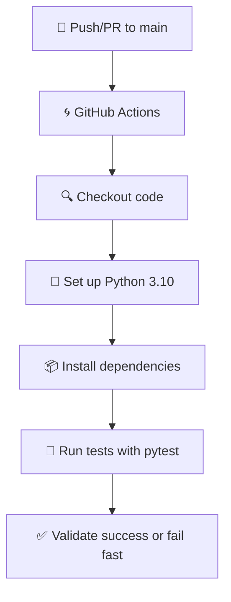

# 🧾 Coupon API

<div align="center">

[](https://www.python.org/downloads/)
[](https://docs.pytest.org/)
[](https://github.com/features/actions)
[](LICENSE)

</div>

---

## 📋 Description

This project is a **simple discount coupon API** developed as a guided exercise for the module **"Automated Regression Testing with CI/CD"**.

🎯 **Main Goal:**  
Demonstrate how a small change in logic can introduce regressions—and how automated tests and CI pipelines help prevent them.

---

## 🛠️ Tech Stack

| Tool        | Version  | Purpose                      |
|-------------|----------|------------------------------|
| 🐍 Python    | 3.10+    | Programming language         |
| 🧪 pytest    | Latest   | Test framework               |
| 🔄 GitHub Actions | -        | CI/CD pipeline automation   |
| 📦 pip       | -        | Dependency management        |

---

## 🏗️ Project Structure

```
📁 coupons-api/
│
├── 📁 app/
│   ├── 🧮 coupons.py        # Business logic for discounts
│   └── 🌐 api.py            # Flask API with /price endpoint
│
├── 📁 tests/
│   ├── 🧪 test_coupons.py   # Unit tests for logic
│   └── 🔗 test_api.py       # Integration tests for the API
│
├── 📄 requirements.txt      # Project dependencies
├── ⚙️ pytest.ini            # Pytest configuration
└── 📁 .github/
    └── 📁 workflows/
        └── 🌀 test-regression.yml  # GitHub Actions CI workflow
```

---

## 🚀 Agile Testing Principles Applied

| 🧠 Principle | Implementation |
|-------------|----------------|
| 🤖 **Test Automation** | Business logic and API are fully tested using `pytest` |
| ⚡ **Fast Feedback** | All tests run automatically on each push/PR via GitHub Actions |
| 🛡️ **Regression Detection** | Intentional changes trigger test failures to catch regressions |
| 📈 **Continuous Quality** | CI pipeline blocks merging of faulty code |

---

## 💻 Local Setup

### 1️⃣ Clone the repository

```bash
git clone https://github.com/gperzal/coupons-api.git
cd coupons-api
```

### 2️⃣ Set up virtual environment and install dependencies

```bash
# Create virtual environment
python -m venv .venv

# Activate it
.venv\Scripts\activate   # Windows
source .venv/bin/activate  # macOS/Linux

# Install dependencies
pip install -r requirements.txt
```

### 3️⃣ Run the tests

```bash
pytest
```

---

## 🧪 Automated Tests

All tests live under the `tests/` directory:

| File | Type | Description |
|------|------|-------------|
| `test_coupons.py` | 🔧 Unit | Tests the discount and tax logic |
| `test_api.py`     | 🔗 Integration | Tests the `/price` endpoint with various payloads |

> ℹ️ `pytest.ini` ensures smooth test discovery and config

---

## 🔄 CI/CD with GitHub Actions

The CI workflow is defined in `.github/workflows/test-regression.yml` and runs on every push or PR to `main`.



---

## ✅ Contribution Guide

| Step | Action |
|------|--------|
| 1️⃣ | Fork the repo |
| 2️⃣ | Create a new branch: `git checkout -b fix/my-fix` |
| 3️⃣ | Write or update tests |
| 4️⃣ | Open a Pull Request |

### PR Checklist:
- [ ] ✅ All tests passing
- [ ] 🧪 New tests added if necessary
- [ ] 📝 README updated if needed

---

## 📜 License

```
📚 This project is for educational purposes only
🎓 Developed as part of a DevOps learning module
```

---

## 👨‍💻 Autor

<div align="center">

**Developed as part of the module**
### 🎯 "Fundamentals and Principles of Agile Testing"

---

<sub>🛠️ Built with ❤️ to learn agile testing and automation</sub>

</div>

---

<div align="center">

### 🌟 If you liked this project, give it a star! ⭐

</div>